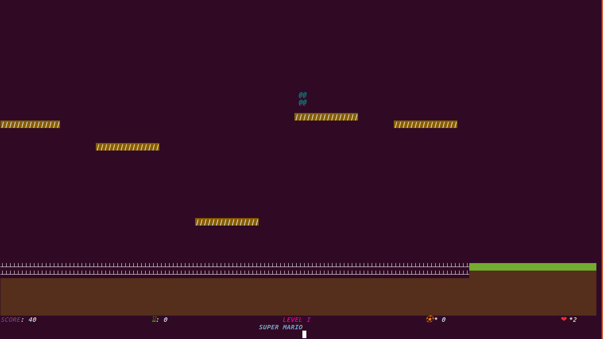

# **My Mario**
A terminal game based on the world famous game **Super Mario Bros** implemented with basic python3.

## **Pre-requistes**
A machine with linux os installed and python3 preferably python3.6

## **Playing the game**
To play the game just clone this repository and execute `python3 main.py`. Even though the game is responsible, play it in full screen for a better view. 

## **Features of game**
*Sound
*Colors
*No Blinking
*Bullets
*Powerups
*Moving Bridges
*Automated moving clouds

## **Bugs**
You tell me :stuck_out_tongue_winking_eye: 

_You will really enjoy playing this game._ 

A few pics of the game

